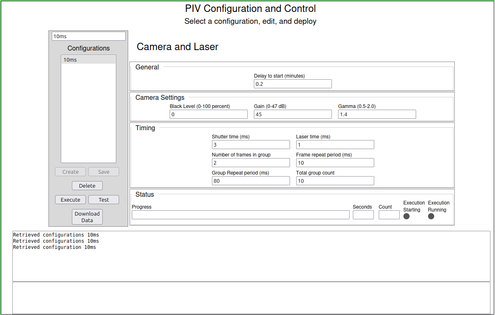
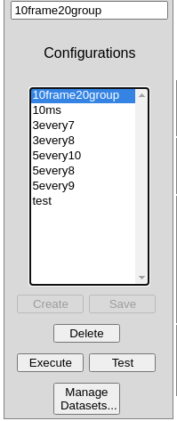
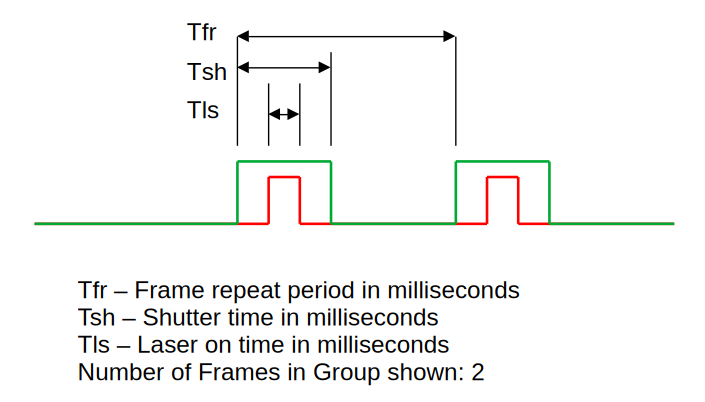
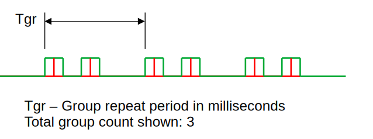
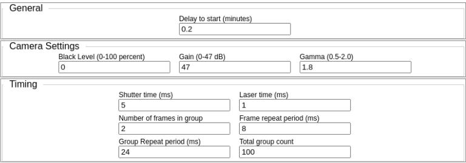

# Laser and Camera controller for PIV

## Control Computer Build and Setup
The control software runs on a variety of small single-board computers (SBCs).  Instructions for setup for some of the most successful are here.

- Orange Pi 5 Pro: For hardware and software installation out of the box, [see here](./SBC_Builds/OrangePi5Pro/README.md).  

After hardware and software are setup, the rest of the [steps are common](./src/README.md).  

## Software User Manual
The real-time control of the camera and laser is done by a Raspberry Pi Pico microcontroller.  Once fed its configuration, it generates the timing required for the camera and laser, and switches each on and off as needed.  It is precise and repeatable down to millisecond resolution.  

The software on the SBC that both controls the Raspberry Pi Pico and acquires the resulting images from the camera is a small Python3 program called pivexec.py.  Pivexec.py communicates to both the Pico and camera over USB.  

The sequence used by pivexec.py during a run is configured through a web page written in javascript and hosted in a Docker container.  It is called portal.js.  The end product of this configuration is to create, edit, modify and delete JSON files containing configurations.  When a configuration file is to be deployed, its name is placed in a special file named `__runfile__.deploy`.  Pivexec.py is constantly watching for this file to be created, and runs whenever it exists.  

Here is an overview of the web portal.  

## Typical Workflow ##
Configuration and deployment is done with a Single-Page Application (SPA) web page.  All features are available in this single page, and can be accessed from any browser.  To access the web page:
1. Make sure your computer has connected to the PIV Wifi hotspot.  Typically, these are named `PIV1`, `PIV2`, etc., and there is no password needed.  During deployment, there will be no Internet access through this hotspot (although Internet is sometimes available during development).
2. Open a tab in your browser and navigate to `http://10.24.1.1`.  Multiple computers can connect to the PIV Wifi and use the SPA page simultaneously.  Multiple users should use common sense to coordinate their actions.

### Select a Configuration ###

Step one is to select or create a configuration.  The list of configurations on the left shows existing configurations; just click on one and you are ready to go.  If you need to create a new one, just type a new name in the edit field above the list and press the `Create` button.  (Hint: The `Create` button uses the values currently showing in all the configuration parameters, so you can use this feture to clone an existing configuration, then change just a few parameters in the clone.)  

To keep things clean, an unused configuration can be deleted simply by selecting it and pressing the `Delete` button.

### Edit fields in the Selected Configuration ###
Once a configuration has been selected, the next step is to ensure that all configuration parameters are correct.  The detailed list of all parameters is discussed below.  If changes are made to one or more parameter fields, they will not take effect until the `Save` button is pressed.  To discard any changes, just navigate away from the configuration, then back to it, without pressing `Save`.

### Deploy a Configuration to the PIV ###
When a configuration has been selected and edited, it can be deployed with the `Execute` button.  As long as the PIV instrument is in Wifi range of a computer, the current status of the deployment will be shown in the `Status` group below the configuration fields.

### Configured Camera and Laser Timing ###
The parameters configured in the fields in the section labeled `Timing` control the length of a *frame*, how many frames make up a *group*, and how many total groups will exist.  Let's cover some definitions of these terms:  

**frame**: A frame constitutes the timing around a single image captured by the camera.  The duration of the frame is given by the shutter time, in milliseconds, referred to as `Tsh` in the diagram below.  The shutter time is how long the camera shutter is held open.  The laser is always pulsed for the laser time, also in milliseconds, referred to as `Tls`.  The laser on time must always be less than the shutter open time, and will automatically be centered within the shutter time in such a way that there will be a dark period before the laser, and an equal dark period after the laser.

An example might help at this point.  Assume the shutter time `Tsh` is 5 ms and the laser time `Tls` is 1 ms.  Then, a **frame** will consist of the shutter opening for 2 ms, followed by the laser for 1 ms, followed by 2 ms before the shutter closes again.

**group**: A group is a number (usually 2) of frames to be taken at a precise interval, referred to as `Tfr` above.  The interval is specified in milliseconds, and is the time between the start of one frame and the start of the next.  Thus, the total amount of time a group takes is the number of frames in the group times `Tfr` plus one more frame time, `Tsh`: (Number of Frames in Group * Tfr) + Tsh.

The run consists of a total group count, where the time `Tgr` in milliseconds specifies the time from the start of the first frame of one group to the start of the first frame of the next group.

To extend the previous example, assume that `Tfr` is 8 ms and `Tgr` is 20 ms.  Since each frame (see above) takes 5 ms, there will be a 3 ms dwell time between the end of the first frame and the start of the second frame.  Let us further assume that the number of frames in each group is configured to 2, and the number of groups in the run is 3.  Now each frame takes 5 ms, with a 3 ms dwell between, so the full group takes 5 + 3 + 5 = 13 ms.  There will then be a 7 ms idle time after the group to allow the full 20 ms `Tgr` to expire before the next group starts.

In general (if we discard the few millisecond error from assuming an idle time after the last group), we can simply compute the time for the full run as: Total number of groups * `Tgr`.

A total dataset for a run is composed of the total group count times the number of frames per group.  The diagram below shows three groups.  Typically, this will be congfigured to a very large number, perhaps whatever will fit on the data drive.  It might even be assumed that the battery will expire before the configured run can complete.

## Buttons, Controls, Configuration Fields and Status ##
The buttons and other controls are designed to allow you to manage a list of configuration files (see the section on Files and Directory Structure below). A listing of the files in the configuration directory on disk is displayed in the list of configurations.  Creating or deleting a configuration creates or deletes a file by the same name.  Each configuration file is a JSON file with a `.json` extension, which is not shown in the list.  The contents of each file is made up of the parameter fields.

### Buttons and Controls ###
  

The following covers the function of each of the buttons in the button group below the list of configurations.  Note that buttons are grayed out when their use is not applicable.  For example, in the screen shot above, the `Create` and `Save` buttons are grayed out, since, in the `Create` case, nothing new has been typed in the configuration name at the top, and in the `Save` case, none of the configuration parameter fields have been changed.

#### `Create` Button ####
The `Create` button is grayed out, so cannot be pressed, unless a change has been entered into the configuration  name field at the top.  Tjos field is normally auto-filled with the name of an existing configuration as configurations are selected in the list.  You can easily clone a configuration by selecting it in the list, changing its name, and pressing `Create`.  Now, you can edit parameter fields to make it unique.  

#### `Save` Button ####
The `Save` button is grayed out, so cannot be pressed, unless a change has been made to one of the parameter fields.  If you are making changes to an existing configuration, be sure to save the changes before executing it.  

#### `Delete` Button ####
The `Delete` button deletes the currently-selected configuration,  That configuration's JSON file will be permanently deleted from disk.  There is no confirmation message; the file is immediately deleted.  

#### `Execute` Button ####
Once a configuration has been selected, and any parameter fields have been edited and saved, the configuration may be executed by the PIV instrument by pressing the `Execute` button.  The execution sequence can take a long time, and collect terrabytes of images in storage, so be sure you are ready when you press this button.  When exectuion starts, the `Execute` button changes to a `Stop` button, which allows you to abort a run.  

The execution sequence is:
- **Delay start**: For the number of minutes configured, wait before starting.  This allows for physical deployment of the instrument.  The `progress` field will display a "delay start" message, and the delay time countdown will be shown in the `Seconds` status field.  
- **Connecting to Camera**: The software stack that allows control of the camera and image acquisition is initialized at this time, and the Camera Settings configuration fields are sent to the camera.  This takes a few seconds.  During this phase, a message is shown in the `progress` field.
- **Data Acqusition**: Using the timing configured in the `Timing` section, the camera shutter and laser will start operating, and images will start being acquired onto disk.  This can operate at very high speed, nearly a hundred images acquired every second.  A message will show in the `progress` field, and the `Count` field will show how many groups have been acquired.  

#### `Test` Button ####
#### `Manage Datasets` Button ####

### Configuration Fields ###

#### General ####
- `Delay to Start`
#### Camera Settings ####
- `Black level`
- `Gain`
- `Gamma`
#### Timing ####
- `Shutter Time`
- `Laser Time`
- `Number of frames in group`
- `Frame repeat period`
- `Group repeat period`
- `Total group count`

### Status and Diagnostic Fields ###
- `Progress`
- `Seconds`
- `Count`
- `Execution Starting`
- `Execution Running`
- `Log Field`
## Files and Directory Structure ##
### Configuraiton Files ###
### Dataset Files ###
### Test Configuration File ###
