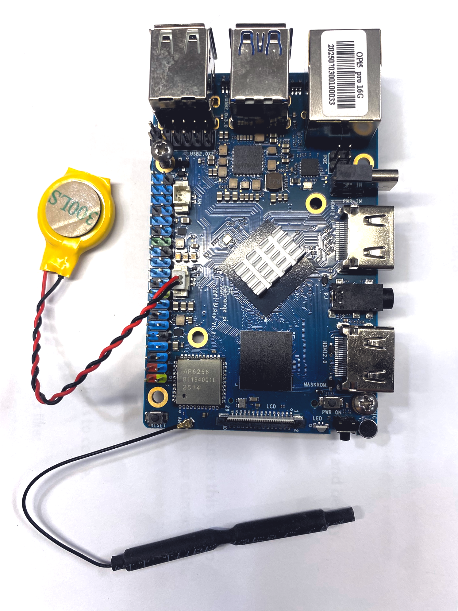
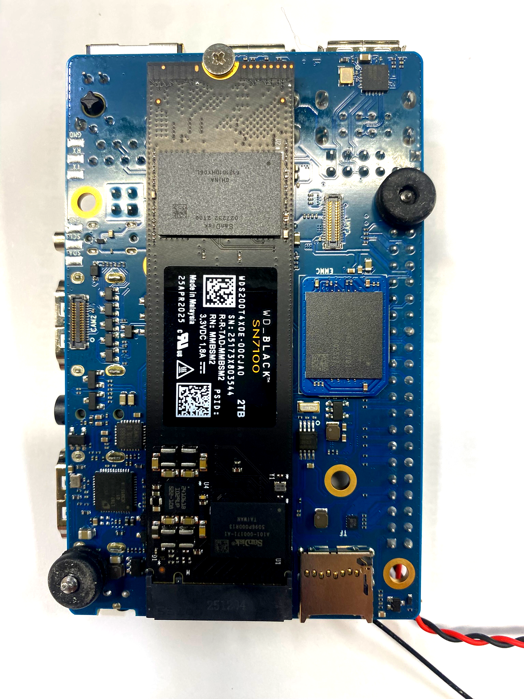
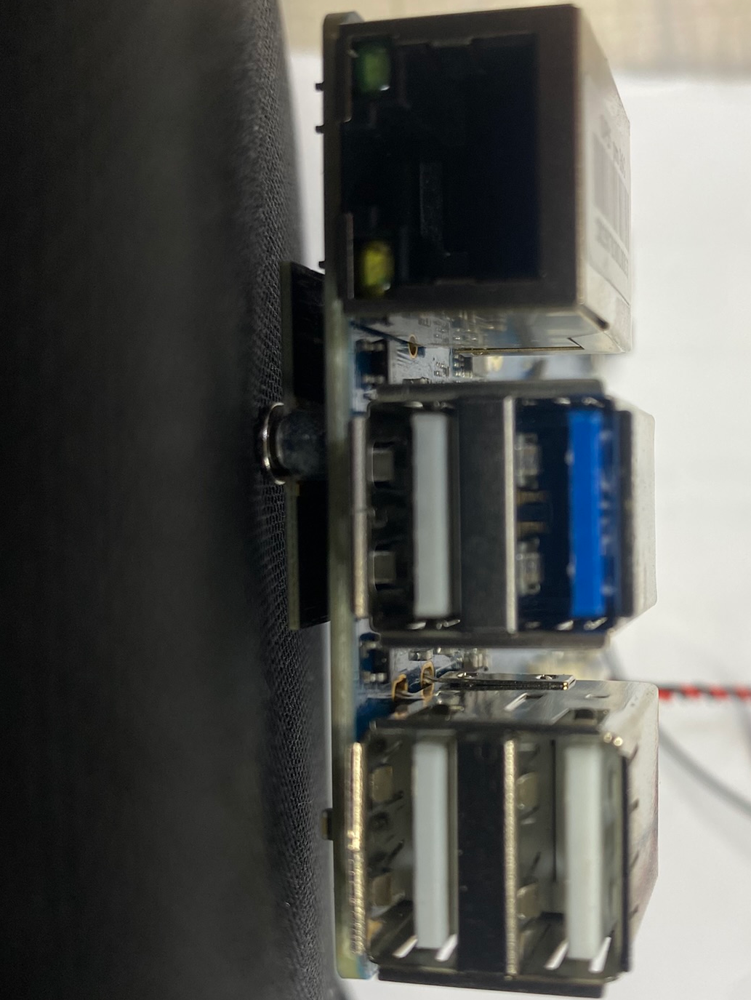
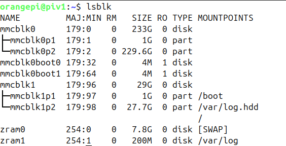
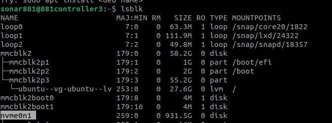
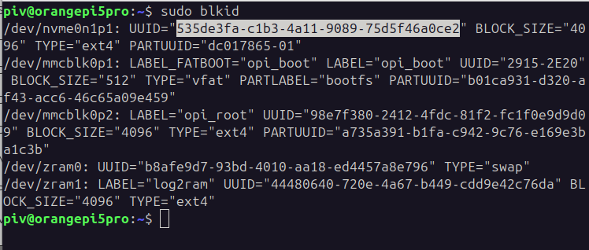
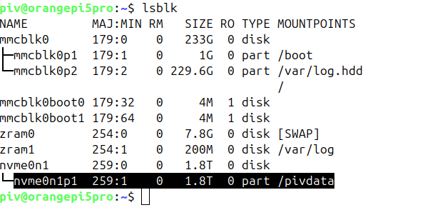
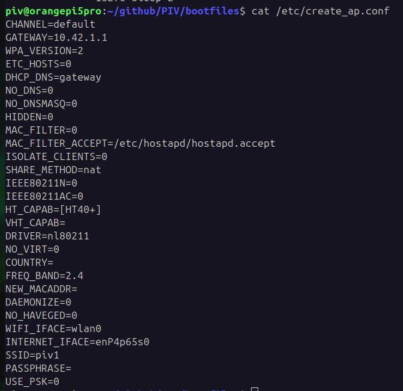

# PIV Controller using Orange Pi 5 Pro

## Orange Pi 5 Pro assembly
At unboxing, the Orange Pi 5 Pro needs the following parts mounted:
- On the front, the Wifi/bluetooth antenna
- On the front, the Real-Time Clock (RTC) battery
- On the back, the EMMC memory module
- On the back, the M.2 drive


<h2>The front of the Orange Pi 5 Pro</h2>
<br>

Note the orientation of the RTC battery connector, which should be a 1.25 mm pitch between pins.  In the orientation shown, the red (positive) wire should be up.  
<br>

The Wifi/bluetooth antenna uses a really tiny friction-fit connector.  This might require magnification just to see how it goes together.  After you are *sure* you have the antenna lead centered on the connector, press firmly.  It might work best with some sort of flat surface, but can be done with a fingertip.
<br clear="all" />



<h2>The back of the Orange Pi 5 Pro</h2>
<br>

The M.2 drive selected should be a 2280 (22 x 80 mm) NVMe drive.  It's recommended to select something that is spec'ed to run without heat sinks or fans.  In this orientation, the connector is on the bottom, and the retaining screw on top of the image.
<br>

The EMMC module provides storage for the boot image and all software.  It is faster and more reliable that a micro SD card, and is the preferred boot device.  In this image, the EMMC module is shown installed just to the right of the M.2 drive.  Note the module's orientation, with the corner cutout at the lower right.  The module's corner cutout should match the silkscreened paint on the Pi.

<br clear="all" />


<h2>The interface edge of the Orange Pi 5 Pro</h2>
<br>

At the left, the wired Ethernet RJ45 connector.  This is not used during operation, but is needed during setup and development.  Although the board has Wifi, the setup procedure repurposes it to provied a Wifi hot spot, so it is not available to connect to the internet.  When an internet connection to Github or other locations is needed during setup, it should be done through the wired Ethernet.
<br>

There are four USB connectors shown.  Note the upper left one has a blue separator, indicating it is USB 3.  This connector provieds faster data rates than the other three, and should be used for the camera.  Any of the three may then be allocated for use by the Raspberry Pi Pico laser/camera controller, mouse and keyboard.
<br>

The micro SD slot is just visible on the bottom of the card.  As decribed in the procedure below, the initial boot is done from a micro SD card in this slot, but the O/S will be copied onto the EMMC module during setup, and the micro SD card should then be removed.  NOTE: If there is a micro SD card present in the slot with a bootable O/S, it will be selected for boot, regardless of whether the EMMC card is also bootable.  During operation, the micro SD card must be removed to allow the card to boot from EMMC.

<br clear="all" />

## Boot the OrangePi
- Burn the file `Orangepi5pro_1.0.6_ubuntu_jammy_desktop_xfce_linux6.1.43.img` into a micro SD card using BalenaEtcher or similar.  The card should be at least 32 GB.
- Insert the SD card into the SBC, plus monitor, keyboard, mouse.  Power up with USB C supply.  The SBC should boot within about 10 seconds, without pressing the power button.
- Optional, but recommended: Install an eMMC module on the back and install a new copy of Linux on it.  The eMMC module is larger, faster, and more reliable than the micro SD card.
  - Install the eMMC module on the back of the OrangePi 5 Pro. See the details in section 2.5.1 of the [manual](./OrangePi_5_Pro_RK3588S_User%20Manual_v1.3-1.pdf), on page 53. Press the two connectors firmly until they snap into place.  **BE SURE TO ORIENT THE MODULE CORRECTLY AS INDICATED BY THE CORNER CUTOUT IN THE SILKSCREEN OUTLINE**
  - Copy the same Ubuntu image file onto the OrangePi 5 Pro using
  `$ scp Orangepi5pro_1.0.6_ubuntu_jammy_desktop_xfce_linux6.1.43.img orangepi@<IP address>:/home/orangepi` # On your host computer.  
  Alternatively, put the file on a USB drive and copy it from there to the `/home/orangepi` directory.
  - The following steps are covered in more detail in section 2.5.2 of the [manual](./OrangePi_5_Pro_RK3588S_User%20Manual_v1.3-1.pdf), starting on page 52.  For the following steps, log into OrantePi 5 Pro as the `orangepi` user and open a console.
  
  - Determine the folder name of the eMMC module.  This example shows the use of the `lsblk` command when the system is booted from the micro SD card.  The goal is to find the name, in this case `mmcblk0`, of the eMMC device.  A couple of hints here give it away
    - `mmcblk0` will have no partitions when first plugged in.  
    - Here we have two partitions, but they are do not show any mountpoints.  mmcblk1 is the micro SD card, and has partitiions that are mounted.  
    - `mmcblk0` shows space slightly less than the 250 GB (233 GB) that the eMMC module is known to be.  Drives never show their full capacity available for storage due to overhead.  

    All devices are represented as folders in the `/dev` directory.  So from the above information, we conclude that the micro SD card is `/dev/mmcblk1` and the eMMC drive is `/dev/mmcblk0`.  We will use this information in the next step.
  

  - Clear the eMMC module and copy the Ubuntu 22.04 image to it.  These steps assume the Ubuntu image is in `/home/orangepi` (the orangepi user root folder), you are using a console logged in as the `orangepi` user, the micro SD card is located at `/dev/mmcblk1`, and the eMMC module is located at `/dev/mmcblk0`, per the steps above.  **THIS IS ONLY AN EXAMPLE, REMEMBER TO CHECK THE LOCATIONS OF THE TWO DRIVES**
    - `$ sudo dd bs=1M if=/dev/zero of=/dev/mmcblk0 count=233000 status=progress conv=sync`  
      `$ sudo sync`  
      `$ sudo dd bs=1M if=Orangepi5pro_1.0.6_ubuntu_jammy_desktop_xfce_linux6.1.43.img of=/dev/mmcblk0 status=progress conv=sync`  
      `$ sudo sync`  

      NOTE: The `count=233000` in the first command is derived from the size of the eMMC module, which is 256 GB, or 256,000 * 1 MB.  It is 233 rather than 256 because the `sudo fdisk -l` command lists the drive's capacity as 232.96 GiB.  Using the specified capacity of `count=256000` should work as well.

  - Power off the Orangepi 5 Pro and remove the micros SD card.  Short-press the power button and confirm that Ubuntu boots directly from the eMMC module.

 - Bring the Ubuntu distro up to date with
   - `sudo apt update`

The remainder of the steps below will work correctly whether you are booting from the eMMC module or micro SD card.

## Create the PIV user
- When logged in (default user is `orangepi`), create the `piv` user on a console with
```
$ sudo adduser piv
[sudo] password for orangepi: orangepi
. . .
New password: piv
```
- Add user `piv` to the `sudo` group: `$ sudo adduser piv sudo`  
- Add user `piv` to the `tty` group: `$ sudo adduser piv tty`  
- Add user `piv` to the `dialout` group: `$ sudo adduser piv dialout`  
- Add user `piv` to the `dialout` group: `$ sudo adduser piv docker`  
- Change the default login at startup to the `piv` user: `$ sudo desktop_login.sh piv`  

- Reboot.  Confirm that the system automatically logs in to user `piv`.  This will be the working user and `/home/piv` will be the working   directory from now on.

## Install the NVMe SSD M.2 drive
### Format the NVMe SSD storage and make a filesystem

Fresh out of the box, the M.2 NVMe drive will be initialized, with no partitions.  Our first job is to create a partition.  If you are re-using an M.2 drive for some reason, this step may already be done.

Make the partition on the M.2 NVMe drive. 

Execute:
`lsblk`




Most likely, your NVMe drive will show up like mine: `/dev/nvme0n1`

To make the partition, execute (using the drive path found from lsblk):

`sudo fdisk /dev/nvme0n1`
- Choose `n` to create a new partition.
- At the prompt, choose `p` for a primary partition.
- Select `1`.
- Other questions will follow, just use defaults.
- When back at the main command, choose `w` to write the data to the disk.

Add a filesystem to the partition.  I initially chose `ntfs` since to provide portability to directly read and write to the SSD if it is removed from this SBC and put into a Windows computer.  This turned out to be unusably slow when saving hundreds of RAW image files per second for a sustained period.  I have found the best filesystem is `ext4`.

Use lsblk again to see the name of the partition you just created.  It is probably named `/dev/nvme0n1p1`.  Make the filesystem with this command.

`sudo mkfs -t ext4 /dev/nvme0n1p1`


### Permanently mount the NVMe M.2 SSD

- Log in as `piv` (password `piv`).
- Create a mount point.  This will be used in `fstab` below, and will be where you see the data for this drive:

`sudo mkdir /pivdata`  
`sudo chown piv:piv /pivdata`  

- At the command prompt, enter:

`sudo blkid`



- Look for the partition you created above, probably `/dev/nvme0n1p1` or `/dev/nvme0n1p2`.  Somewhere in the line for this partition, should be `UUID=”535de3fa-c1b3-4a11-9089-75d5f46a0ce2”`.  Your UUID will of course be different, but will be some long string of Hex digits.  Highlight the UUID (less quotation marks) and copy.

- Now, edit `/etc/fstab`.  To do this, enter:

`cd /etc`

`sudo nano fstab`

At the bottom, enter a line like

`UUID=535de3fa-c1b3-4a11-9089-75d5f46a0ce2 /pivdata       ext4   defaults  0  0`

- Note that the string of hex digits following ‘UUID=’ must be the UUID you captured from the blkid command above.
- Exit the editor, saving the file, and test it with

`sudo mount -a`

- Issuing a new lsblk command should show the mount point `/pivdata` for the partition you mounted, and you should see a file or two at `/pivdata`.


  
-Try creating a subfolder and writing a file.


### Enable the Wifi hotspot
This step uses a utility called `create_ap` that is alredy installed on the OrangePi OS image to create the necessary network environment for a Wifi hotspot.  The hotspot will have and SSID called `pivN`, where `N` will be an integer identifying the PIV controller instance.  It will be an open Wifi hotspot with no password.

The `create_ap` utility does not permanently open the Wifi hotspot, but must remain running for the hotspot to be available.  To make this happen automatically on boot, a service is created and enabled.  The service is defined by the file `create_ap.service` in the `bootfiles` directory of this repo.  The details of the configuration of the Wifi hotspot are defined in a file called `create_ap.conf`, also in the `bootfiles` directory.

Here is the content of the create_ap.conf file:  


There are a couple of setting that you may want to alter before starting the Wifi hotspot:
- `FREQ_BAND=2.4`  Change this number to `5` to use the faster 5 GHz Wifi band.  The tradeoff is that 2.4 GHz will penetrate better through walls and other obstacles, so may give better range, even as the system is deployed.
- `INTERNET_IFACE=enP4p65S0`  This interface name is the wired ethernet of the Orange Pi 5 Pro.  It will almost certainly be the same on future systems built with the same hardware.  Check with the command `> ip a` to confirm.
- `SSID=piv1`  Change this for future instances of the PIV controller to `piv2` etc.  This way, if more than one PIV controller is in the same deployment and powered on, they will all have distinct Wifi access point names.
- `PASSPHRASE=`  This is currently set to no password so the Wifi hotspot is open for all to log in to.  If this is not desired, set this to a password with at least 8 characters.

Copy the service file and configuration file to their required location while logged in as the `piv` user.  Remember, the password for the `piv` user, if needed, is `piv`.

`> cd /github/PIV/bootfiles`  
`> sudo cp create_ap.service /etc/systemd/system`  
`> sudo cp create_ap.conf /etc`  
`> sudo systemctl enable create_ap.service`  
`> sudo systemctl start create_ap.service`  

This should allow the service to run on boot (`systemctl enable`) and start it immediately (`systemctl start`).  To confirm it is running, use  
`> systemctl status create_ap.service`  

This should output a lot of information about the service, including `active(running)`.


### Install the Real-Time Clock backup battery
The Orange Pi 5 Pro uses the Rockchip RK3688S with an on-chip Real-time clock (RTC) module, so no external module is required.  However, the board is not supplied with a back battery, so the RTC will lose track of time whenever the power is off.  There is a small 2-pin header beside the 40-pin GPIO header labeled `RTC` that accepts a standard CR2032 3V battery with a 1.25mm pitch.  Note not to use the similar fan header.  The red wire from the battery goes on the left when viewed from the close edge, aslo marked in the silkscreen with a `+`.


## Install software
- **Visual Studio Code**
  - Go to the Visual Studio Code download page and download the .deb file for Arm64.
  - In a console, `$ cd ~/Downloads` and install the local package with `$ sudo apt install [file name starting with code_].deb`.
  - After the installation starts, watch for popups asking for permission to access repositories, and grant permission.
- **The piv controller repository**
  - In a console, `$ mkdir github` and `$ cd github`.
  - Clone the repository with `$ git clone https://github.com/coastalboundarydynamicsresearchgroup/PIV.git`.
- **FLIR software (Spinnaker SDK, SpinView)**
  - [Where to get the files from?]  Obtain the file `spinnaker-4.2.0.46-arm64-22.04-pkg.tar.gz`.  Extract its contents with `tar -xzvf <filename>`, then `$ cd spinnaker-4.2.0.46-arm64`.
  - Follow the instructions in the READM.md file for Ubuntu 22.04.  This should boil down to two steps:
    1. `$ sudo apt-get install libusb-1.0-0 qtbase5-dev qtchooser qt5-qmake qtbase5-dev-tools`
    2. `sudo sh install_spinnaker_arm.sh`

    The second script will install the whole spinnaker package, asking for permission to install various options.  Take the default 'Y' answer for all but the last question about a giga camera.

- **FLIR Python toolkit**
  - [Where to get the file from?]  Obtain the file `spinnaker_python-4.2.0.46-cp310-cp310-linux_aarch64-22.04.tar.gz`.  Extract its contents with `tar -xzvf <filename>, then `$ cd spinnaker_python-4.2.0.46-cp310-cp310-linux_aarch64-22.04`.
  - Follow the instructions in the README.md file for Ubuntu 22.04.  **Be sure to run `sudo apt update` before executing the instructions**.
  - You may need to install pip for python3 using `sudo apt install python3-pip`.
- **Docker**
  This image of Ubuntu 22.04 comes with Docker pre-installed, so no action is needed here.

  - Add user `piv` to the `docker` group: `$ sudo adduser piv docker`
  - Ensure the docker service starts at boot: `$ sudo systemctl enable docker`
  
