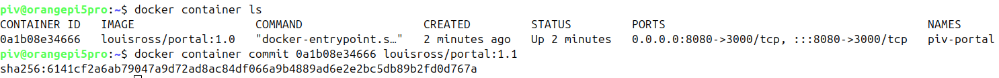

# PIV Controller Software setup

## Create necessary
## Generic Steps to Build Docker Containers
Some of the components of the PIV controller run in docker containers, and the first step in software setup is to build these containers.  
There are scripts for these components, which do the majority of the setup work, but the `npm install` step sometimes fails during the build and must be done manually later:
- `./dockb`       # Build the 1.0 version of the container  
- `./dock-start`  # Launch a console in the (posibly) partially-built container  
- `npm start`     # Attempt to run the component inside the container, if it fails then:  
- `npm install`   # Redo the failed step  
- `npm start`     # Rerun the component inside the container, confirm it works now  

When the 1.0 version is working, the running container must be committed as the 1.1 version, which will be what runs in production.  On a new console:  
`docker container ls` to obtain the container ID, then `docker container commit <container ID> louisross/<component>:1.1`:

From this point, the 1.0 version is considered deprecated, and only the 1.1 version will be run.  The `./dock` command will run the 1.1 version in a console for debugging.

## Build the `portal` Component
The PIV code is assumed to have been cloned from the github repositry into a folder called `~/github`.  Thus, the `portal` component is in `~/github/PIV/src/portal`.

Execute the generic steps above in the `~/github/PIV/src/portal` directory, commiting the 1.1 version as `louisross/portal:1.1`.

## Build the `pivdeploy` Component
The PIV code is assumed to have been cloned from the github repository into a folder called `~/github`.  Thus, the `pivdeploy` component is in `~/github/PIV/src/pivdeploy`.

Execute the generic steps above in the `~/github/PIV/src/pivdeploy` directory, commiting the 1.1 version as `louisross/piv-deploy:1.1`.

## Install Dependencies for pivexec Component
`$ python -m pip install --user watchdog,pyserial,requests`

`$ mkdir /pivdata/data`  
`$ mkdir /pivdata/configuration`  

